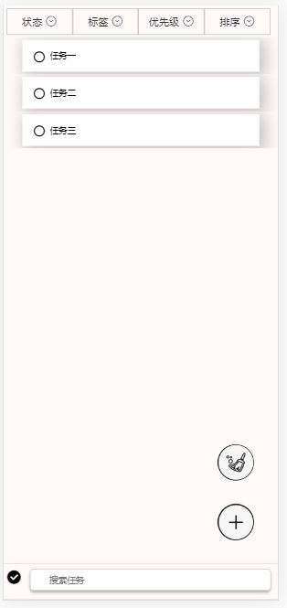
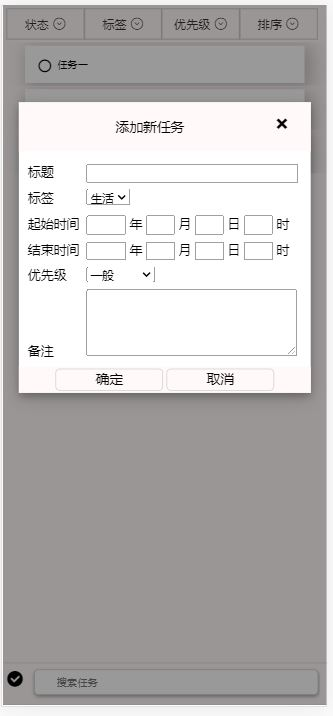
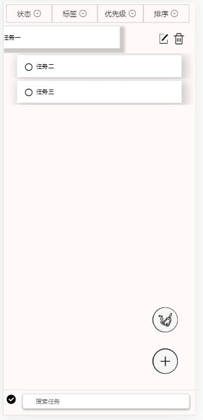

## 脚本程序设计期末项目：手机版ToDoMVC

```
学号：1754225
姓名：宁新智
```

#### 使用说明

- 本项目仅适用于手机端，且在chrome浏览器上经过测试可以完美运行。

- 在项目根目录下运行

```
serve
```

- 使用浏览器打开 http://localhost:5000/templates/TodoMVC 即可

#### 页面展示








#### 基本功能

- 展示：上方菜单栏与下方搜索栏位置固定不变，中间展示内容可以上下浮动（当内容足够多时）

- 增加：点击右下角悬浮加号按钮，会弹出一个文本框，其中标题是必填项，其他可选，编辑后点击确定即可添加新的todo。
- 删除单条todo：用手指长按左移todo，即可显示一个编辑按钮一个删除按钮，点击删除按钮即可删除。
- 全部完成：点击左下角“对勾”图标即可将当前页面显示的所有任务的状态变为已完成。
- 数据持久化：使用localstorage存储数据，刷新页面后可恢复。

#### 高级功能

- 点击todo查看详情：用手指点击单条todo即可查看详情，但不可编辑具体内容。

- todo左移交互：用手指长按左移todo，即可显示一个编辑按钮一个删除按钮，右移恢复。

- 编辑单条todo：用手指长按左移todo，即可显示一个编辑按钮一个删除按钮，点击编辑按钮即可删除。
- 悬浮按钮：右下角有“添加”，“清除”两个悬浮按钮，为避免遮挡todo内容，用户可上下拖动悬浮按钮。
- 筛选功能：用户可点击页面上方“状态”，“标签”，“优先级”菜单来筛选符合条件的todo，三种筛选可以叠加。
- 排序功能：用户可以选择“默认”，“起始时间”，“完成时间”，“优先级”四种排序方式。其中“优先级”会将当前页面所有todo按优先级从高到低排序，“起始时间”与“完成时间”会将当前页面所有todo按起始（完成）时间从早到晚排序（若用户未编辑时间则对应时间视为无穷大）。排序功能与筛选功能可以叠加进行。
- 搜索功能：用户可以在下方搜索栏输入文字并按回车，则会筛选出标题或备注中含有指定文字的todo并显示给用户。搜索功能与筛选功能、排序功能可以叠加进行。
- 批量删除功能：点击右下角“清扫”悬浮按钮，则可以批量删除当前页面所有todo，用户可以筛选/搜索出符合条件的todo并批量删除之。

#### github地址

​	https://github.com/cainiao66/ToDoMVC

#### 服务器部署地址

​	http://49.235.62.59/todo

#### 参考开源代码

- 筛选菜单与搜索框部分参考：[https://github.com/Mark-1994/css3-flex/tree/master/H5-flex%E5%B8%83%E5%B1%80](https://github.com/Mark-1994/css3-flex/tree/master/H5-flex布局)

- 弹出文本框实现参考：https://blog.csdn.net/qq_36430299/article/details/55258303?utm_medium=distribute.pc_relevant.none-task-blog-baidujs-1